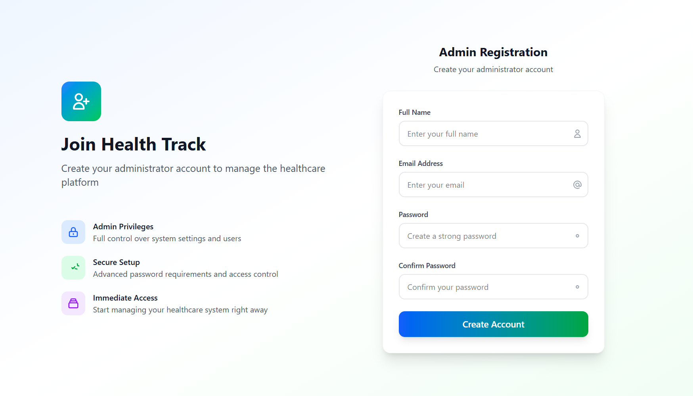

## Overview
Health-Track is a modern healthcare management platform designed to streamline patient care, clinical workflows, and data analytics for hospitals, doctors, and patients.


## Features
- Secure admin registration and authentication
- Role-based dashboards for Admin, Doctor, Patient, Pharmacist
- AI-powered analytics and smart recommendations
- Electronic Health Records (EHR) management
- Lab integration and reporting
- JWT-based security
- Responsive, modern UI

w
## Technologies Used
- React.js (Frontend)
- Node.js & Express (Backend)
- MongoDB (Database)
- Tailwind CSS (Styling)
- Lucide React (Icons)
- JWT (Authentication)


## Screenshots




## Installation
1. Clone the repository:
   ```sh
   git clone https://github.com/abhinavkumar2369/Health-Track.git
   ```
2. Install dependencies for frontend and backend:
   ```sh
   cd frontend && npm install
   cd ../backend/server && npm install
   ```
3. Start the backend server:
   ```sh
   npm start
   ```
4. Start the frontend:
   ```sh
   cd ../../frontend
   npm run dev
   ```


## Usage
- Visit the homepage to explore features
- Register as an admin to access the admin dashboard
- Sign in as doctor, patient, or pharmacist for respective dashboards


## License
This project is licensed under the Apache License, Version 2.0. See the [LICENSE](./LICENSE) file for details.


## Contributing
Contributions are welcome! Just fork this repo, make your changes, and open a pull request.


## Credits
- [Abhinav Kumar](https://github.com/abhinavkumar2369)
- [vemkaze](https://github.com/vemkaze)