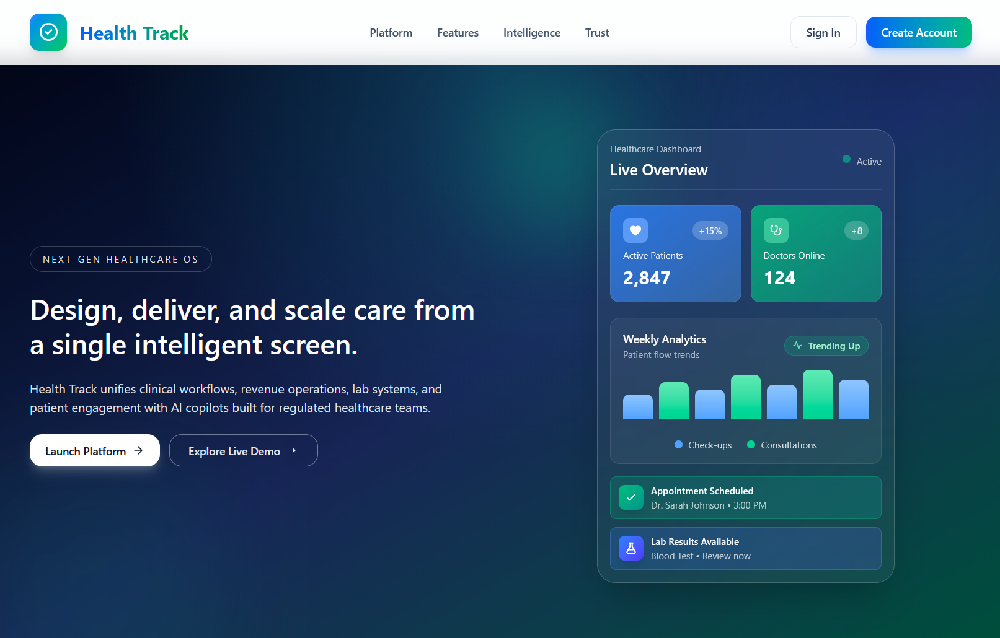
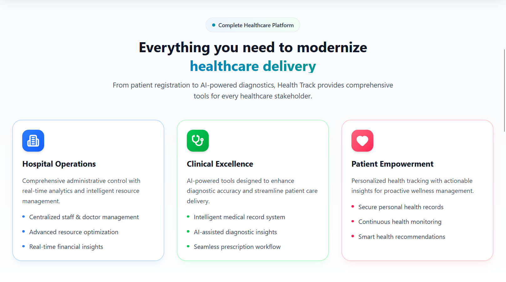
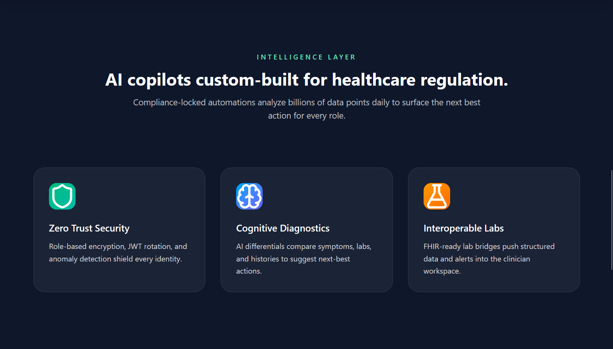
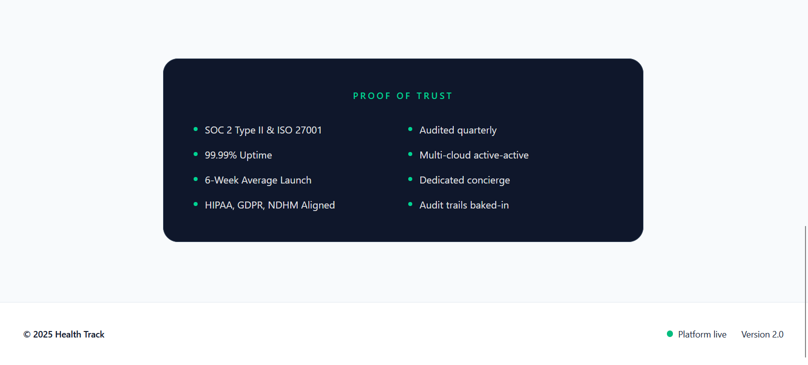

## Overview ✨

Health-Track is a modern healthcare management platform designed to streamline patient care, clinical workflows, and data analytics for hospitals, doctors, and patients. Built with a robust Node.js/Express backend and a responsive React.js frontend, it provides role-based access control for administrators, doctors, pharmacists, and patients.

---

## Table of Contents

- [Features](#features-)
- [Screenshots](#screenshots-️)
- [Technologies Used](#technologies-used-️)
- [Project Architecture](#project-architecture-)
- [Data Structures](#data-structures-)
- [API Documentation](#api-documentation-)
- [Getting Started](#getting-started-)
- [Environment Variables](#environment-variables-)
- [Usage](#usage-)
- [License](#license-)
- [Contributing](#contributing)
- [Credits](#credits)

---

## Features 🚀

### Core Features

- **Secure Authentication**: JWT-based authentication with role-based access control
- **Role-Based Dashboards**: Dedicated dashboards for Admin, Doctor, Patient, and Pharmacist
- **Electronic Health Records (EHR)**: Digital management of patient records and medical history
- **Responsive Modern UI**: Built with React.js and Tailwind CSS for a seamless experience

### Admin Features

- Register and manage doctors, pharmacists, and patients
- View organization-wide statistics (doctor count, pharmacist count, patient count)
- Profile management with password change functionality
- Full CRUD operations for all staff members

### Doctor Features

- Add and manage patients assigned to them
- View patient list and patient details
- Profile management and secure password updates

### Pharmacist Features

- **Inventory Management**: Add, update, and remove medicines
- **Medicine Dispensing**: Issue medicines to patients with stock tracking
- **Transaction History**: Complete audit trail of all inventory operations
- **Report Generation**: Generate PDF reports (inventory, transaction, summary) stored in AWS S3
- **Inventory Statistics**: Real-time stats including low stock and out-of-stock alerts
- Profile management with secure password updates

### Patient Features

- **Document Management**: Upload, view, and delete medical documents (lab reports, prescriptions, scans)
- **Secure File Storage**: Documents stored securely in AWS S3 with pre-signed URLs
- Access to personal health records

---

## Screenshots 🖼️

### Homepage






### Authentication


---

## Technologies Used 🛠️

### Frontend

| Technology       | Purpose                    |
| ---------------- | -------------------------- |
| React.js 19      | UI Framework               |
| React Router 7   | Client-side routing        |
| Tailwind CSS 4   | Styling                    |
| Axios            | HTTP client                |
| Lucide React     | Icons                      |
| Vite             | Build tool and dev server  |

### Backend

| Technology       | Purpose                    |
| ---------------- | -------------------------- |
| Node.js          | Runtime environment        |
| Express.js       | Web framework              |
| MongoDB          | Database                   |
| Mongoose         | MongoDB ODM                |
| JWT              | Authentication             |
| bcryptjs         | Password hashing           |
| AWS SDK          | S3 file storage            |
| Multer           | File upload handling       |
| PDFKit           | PDF report generation      |
| Twilio           | SMS notifications          |

---

## Project Architecture 🏗️

```
Health-Track/
├── backend/
│   ├── config/
│   │   └── s3Config.js          # AWS S3 configuration
│   ├── middleware/
│   │   └── authMiddleware.js    # JWT authentication middleware
│   ├── models/                  # MongoDB schemas
│   │   ├── Admin.js
│   │   ├── Doctor.js
│   │   ├── Patient.js
│   │   ├── Pharmacist.js
│   │   ├── Medicine.js
│   │   ├── Document.js
│   │   ├── Report.js
│   │   ├── Schedule.js
│   │   ├── Transaction.js
│   │   └── User.js
│   ├── routes/                  # API route handlers
│   │   ├── authRoutes.js
│   │   ├── adminRoutes.js
│   │   ├── doctorRoutes.js
│   │   ├── pharmacistRoutes.js
│   │   ├── documentRoutes.js
│   │   ├── patientRoutes.js
│   │   └── aiRoutes.js
│   ├── db.js                    # MongoDB connection
│   ├── server.js                # Express server entry point
│   ├── package.json
│   └── vercel.json              # Vercel deployment config
├── frontend/
│   ├── src/
│   │   ├── pages/               # React page components
│   │   │   ├── Homepage.jsx
│   │   │   ├── SignIn.jsx
│   │   │   ├── SignUp.jsx
│   │   │   ├── AdminDashboard.jsx
│   │   │   ├── DoctorDashboard.jsx
│   │   │   ├── PatientDashboard.jsx
│   │   │   ├── PharmacistDashboard.jsx
│   │   │   └── NotFound.jsx
│   │   ├── services/            # API service layer
│   │   │   ├── api.js
│   │   │   └── authService.js
│   │   ├── App.jsx              # Main app with routing
│   │   ├── main.jsx             # Entry point
│   │   └── index.css            # Global styles
│   ├── public/
│   ├── package.json
│   └── vite.config.js
└── docs/
    ├── screenshots/
    └── roadmap.txt
```

---

## Data Structures 📊

### MongoDB Models

#### Admin Schema

```javascript
{
  fullname: String (required),
  email: String (unique, required),
  password: String (required, hashed),
  role: String (default: "admin"),
  gender: String (enum: ["male", "female", "other", ""]),
  phone: String,
  timestamps: true
}
```

#### Doctor Schema

```javascript
{
  name: String (required),
  email: String (unique, required),
  password: String (required, hashed),
  specialization: String,
  admin_id: ObjectId (ref: "Admin", required),
  role: String (default: "doctor"),
  timestamps: true
}
```

#### Patient Schema

```javascript
{
  name: String (required),
  email: String (unique, required),
  password: String (required, hashed),
  doctor_id: ObjectId (ref: "Doctor", required),
  admin_id: ObjectId (ref: "Admin"),
  role: String (default: "patient"),
  timestamps: true
}
```

#### Pharmacist Schema

```javascript
{
  name: String (required),
  email: String (unique, required),
  password: String (required, hashed),
  gender: String (enum: ["male", "female", "other", ""]),
  phone: String,
  inventory: [String],
  admin_id: ObjectId (ref: "Admin", required),
  role: String (default: "pharmacist"),
  timestamps: true
}
```

#### Medicine Schema

```javascript
{
  name: String (required),
  description: String,
  quantity: Number (default: 0),
  category: String,
  expiryDate: Date,
  price: Number,
  patient_id: ObjectId (ref: "Patient"),
  doctor_id: ObjectId (ref: "Doctor"),
  pharmacist_id: ObjectId (ref: "Pharmacist"),
  timestamps: true
}
```

#### Document Schema

```javascript
{
  title: String (required),
  description: String,
  fileUrl: String,
  patient_id: ObjectId (ref: "Patient"),
  doctor_id: ObjectId (ref: "Doctor"),
  uploadedBy: ObjectId (ref: "Doctor"),
  fileName: String,
  originalName: String,
  fileType: String,
  fileSize: Number,
  s3Key: String,
  s3Url: String,
  category: String (enum: ["lab-report", "prescription", "scan", "consultation", "other"]),
  status: String (enum: ["pending", "verified", "under-review"]),
  timestamps: true
}
```

#### Transaction Schema

```javascript
{
  type: String (required, enum: ["add", "issue", "remove", "update"]),
  medicineName: String (required),
  medicineId: ObjectId (ref: "Medicine"),
  quantity: Number (required),
  price: Number,
  totalAmount: Number,
  patientName: String,
  notes: String,
  pharmacist_id: ObjectId (ref: "Pharmacist", required),
  previousQuantity: Number,
  newQuantity: Number,
  timestamps: true
}
```

#### Report Schema

```javascript
{
  title: String (required),
  description: String,
  reportType: String (enum: ["inventory", "transaction", "summary", "custom"]),
  pharmacist_id: ObjectId (ref: "Pharmacist", required),
  fileName: String,
  originalName: String,
  fileType: String (default: "application/pdf"),
  fileSize: Number,
  s3Key: String,
  s3Url: String,
  dateFrom: Date,
  dateTo: Date,
  generatedAt: Date,
  status: String (enum: ["generating", "completed", "failed"]),
  timestamps: true
}
```

#### Schedule Schema

```javascript
{
  doctor_id: ObjectId (ref: "Doctor"),
  patient_id: ObjectId (ref: "Patient"),
  appointmentDate: Date (required),
  notes: String,
  timestamps: true
}
```

---

## API Documentation 📡

### Base URL

- **Local Development**: `http://localhost:5000`
- **Production**: Your deployed API URL

### Health Check Endpoints

| Method | Endpoint       | Description                |
| ------ | -------------- | -------------------------- |
| GET    | `/`            | API status and version     |
| GET    | `/api/health`  | Health check with uptime   |

### Authentication Routes (`/auth`)

| Method | Endpoint    | Description                              | Request Body                                       |
| ------ | ----------- | ---------------------------------------- | -------------------------------------------------- |
| POST   | `/sign-up`  | Register new admin (role must be "admin")| `{ fullname, email, password, role: "admin" }`     |
| POST   | `/sign-in`  | Sign in for all roles                    | `{ email, password, role }`                        |

> **Note**: The `/sign-up` endpoint only allows admin registration. The `role` field must be set to `"admin"`. Other user types (doctors, pharmacists, patients) are created by admins through the admin routes.

**Response**: Returns JWT token and user object

### Admin Routes (`/admin`)

| Method | Endpoint               | Description                      | Auth Required |
| ------ | ---------------------- | -------------------------------- | ------------- |
| POST   | `/add-user`            | Add doctor or pharmacist         | Yes (Admin)   |
| GET    | `/users`               | Get all staff (doctors/pharmacists) | Yes (Admin)   |
| DELETE | `/remove-user/:id`     | Remove doctor or pharmacist      | Yes (Admin)   |
| GET    | `/patients`            | Get all patients                 | Yes (Admin)   |
| POST   | `/add-patient`         | Add a new patient                | Yes (Admin)   |
| DELETE | `/remove-patient/:id`  | Remove a patient                 | Yes (Admin)   |
| GET    | `/profile`             | Get admin profile                | Yes (Admin)   |
| PUT    | `/profile`             | Update admin profile             | Yes (Admin)   |
| PUT    | `/change-password`     | Change admin password            | Yes (Admin)   |

### Doctor Routes (`/doctor`)

| Method | Endpoint               | Description                      | Auth Required |
| ------ | ---------------------- | -------------------------------- | ------------- |
| GET    | `/my-patients`         | Get patients assigned to doctor  | Yes (Doctor)  |
| POST   | `/add-patient`         | Add a new patient                | Yes (Doctor)  |
| DELETE | `/remove-patient/:id`  | Remove a patient                 | Yes (Doctor)  |

### Pharmacist Routes (`/pharmacist`)

| Method | Endpoint                      | Description                        | Auth Required    |
| ------ | ----------------------------- | ---------------------------------- | ---------------- |
| POST   | `/add-medicine`               | Add medicine to inventory          | Yes (Pharmacist) |
| GET    | `/medicines`                  | Get all medicines                  | Yes (Pharmacist) |
| PUT    | `/update-medicine/:id`        | Update medicine details            | Yes (Pharmacist) |
| POST   | `/issue-medicine`             | Issue medicine to patient          | Yes (Pharmacist) |
| DELETE | `/remove-medicine/:id`        | Remove medicine from inventory     | Yes (Pharmacist) |
| GET    | `/inventory-stats`            | Get inventory statistics           | Yes (Pharmacist) |
| GET    | `/transactions`               | Get all transactions               | Yes (Pharmacist) |
| GET    | `/profile`                    | Get pharmacist profile             | Yes (Pharmacist) |
| PUT    | `/profile`                    | Update pharmacist profile          | Yes (Pharmacist) |
| PUT    | `/update-password`            | Change pharmacist password         | Yes (Pharmacist) |
| GET    | `/reports`                    | Get all generated reports          | Yes (Pharmacist) |
| POST   | `/generate-report`            | Generate a new PDF report          | Yes (Pharmacist) |
| GET    | `/report-download/:reportId`  | Get report download URL            | Yes (Pharmacist) |
| DELETE | `/report/:reportId`           | Delete a report                    | Yes (Pharmacist) |

### Document Routes (`/api/documents`)

| Method | Endpoint               | Description                           | Auth Required  |
| ------ | ---------------------- | ------------------------------------- | -------------- |
| POST   | `/upload`              | Upload a medical document             | Yes (Patient)  |
| POST   | `/list`                | Get all documents for patient         | Yes (Patient)  |
| POST   | `/view/:documentId`    | Get pre-signed URL to view document   | Yes (Patient)  |
| POST   | `/download/:documentId`| Get pre-signed URL to download        | Yes (Patient)  |
| DELETE | `/:documentId`         | Delete a document                     | Yes (Patient)  |

### Database Interaction

The application uses **Mongoose** as the ODM (Object Document Mapper) for MongoDB. Key database interactions include:

1. **Connection Management**: Singleton pattern with connection pooling (`db.js`)
2. **CRUD Operations**: Full create, read, update, delete operations for all entities
3. **References**: Documents use ObjectId references for relationships (e.g., `doctor_id` in Patient)
4. **Timestamps**: All models include automatic `createdAt` and `updatedAt` fields
5. **Indexing**: Unique indexes on email fields for fast lookups

---

## Getting Started 🚀

### Prerequisites

- **Node.js** (v18 or higher recommended)
- **npm** or **yarn**
- **MongoDB** (local installation or MongoDB Atlas)
- **AWS Account** (optional, for S3 file storage)

### Installation

1. **Clone the repository**

   ```bash
   git clone https://github.com/abhinavkumar2369/Health-Track.git
   cd Health-Track
   ```

2. **Backend Setup**

   ```bash
   cd backend
   npm install
   ```

3. **Frontend Setup**

   ```bash
   cd ../frontend
   npm install
   ```

### Running the Application

1. **Start the Backend Server**

   ```bash
   cd backend
   npm start
   # or for development with hot reload:
   npm run dev
   ```

   The backend server will start at `http://localhost:5000`

2. **Start the Frontend Development Server**

   ```bash
   cd frontend
   npm run dev
   ```

   The frontend will start at `http://localhost:5173` (default Vite port)

3. **Build Frontend for Production**

   ```bash
   cd frontend
   npm run build
   ```

---

## Environment Variables 🔐

### Backend (`backend/.env`)

Create a `.env` file in the `backend` directory:

```env
# Server Configuration
PORT=5000

# MongoDB Configuration
MONGO_URI=mongodb://localhost:27017/health-track

# JWT Secret (Change this in production!)
JWT_SECRET=your_super_secret_jwt_key_change_this_in_production

# AWS S3 Configuration (Optional - for file storage)
AWS_ACCESS_KEY_ID=your_aws_access_key
AWS_SECRET_ACCESS_KEY=your_aws_secret_key
AWS_REGION=your_aws_region
AWS_BUCKET_NAME=your_bucket_name

# Twilio Configuration (Optional - for SMS)
TWILIO_ACCOUNT_SID=your_twilio_sid
TWILIO_AUTH_TOKEN=your_twilio_token
TWILIO_PHONE_NUMBER=your_twilio_phone
```

### Frontend (`frontend/.env`)

Create a `.env` file in the `frontend` directory:

```env
# Backend API URL
VITE_API_URL=http://localhost:5000
```

---

## Usage 🏥

### Getting Started as an Admin

1. Visit the homepage at `http://localhost:5173`
2. Click **Sign Up** to create a new admin account
3. Fill in your details and register
4. You'll be redirected to the Admin Dashboard

### Admin Dashboard

- Add and manage doctors, pharmacists, and patients
- View organization statistics
- Update your profile and change password

### Doctor Dashboard

- Sign in with your doctor credentials
- View and manage your assigned patients
- Add new patients to your care

### Pharmacist Dashboard

- Sign in with your pharmacist credentials
- Manage medicine inventory (add, update, remove)
- Issue medicines to patients
- View transaction history
- Generate and download reports

### Patient Dashboard

- Sign in with your patient credentials
- Upload and manage medical documents
- View your health records

---

## License 📄

This project is licensed under the Apache License, Version 2.0. See the [LICENSE](./LICENSE) file for details.

---

## Contributing

Contributions are welcome! Here's how you can contribute:

1. Fork the repository
2. Create a feature branch (`git checkout -b feature/amazing-feature`)
3. Commit your changes (`git commit -m 'Add some amazing feature'`)
4. Push to the branch (`git push origin feature/amazing-feature`)
5. Open a Pull Request

Please ensure your code follows the existing style and includes appropriate tests.

---

## Credits

- [Abhinav Kumar](https://github.com/abhinavkumar2369)
- [vemkaze](https://github.com/vemkaze)
